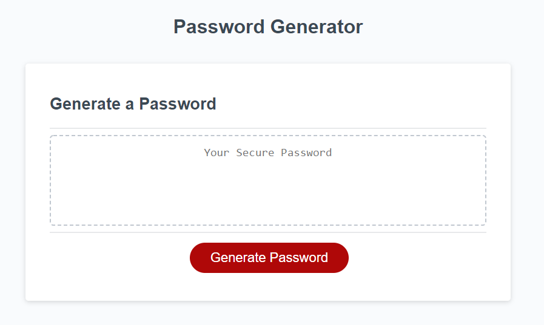

# password-generator 

Password Generator is a repository dedicated to randomly generating a password for secure usage. The way the generator is programed makes it so there is a 0% chance of getting anything less than the parameters selected by the user.

This is deployed [here](https://mrcartree.github.io/password-generator/)

Authored by [Zach LaFleur](http://github.com/MrCartree)